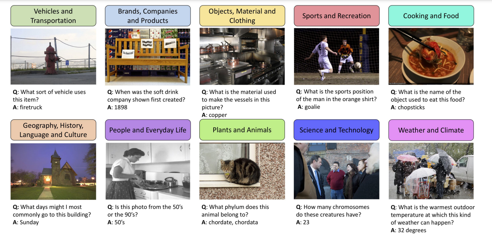
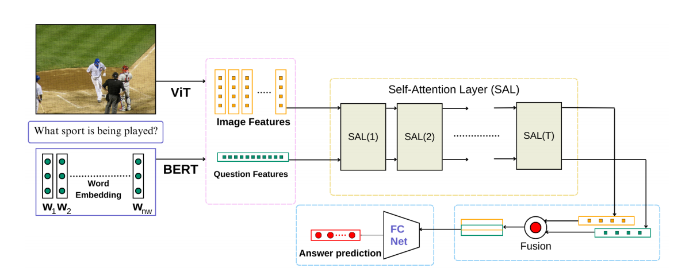
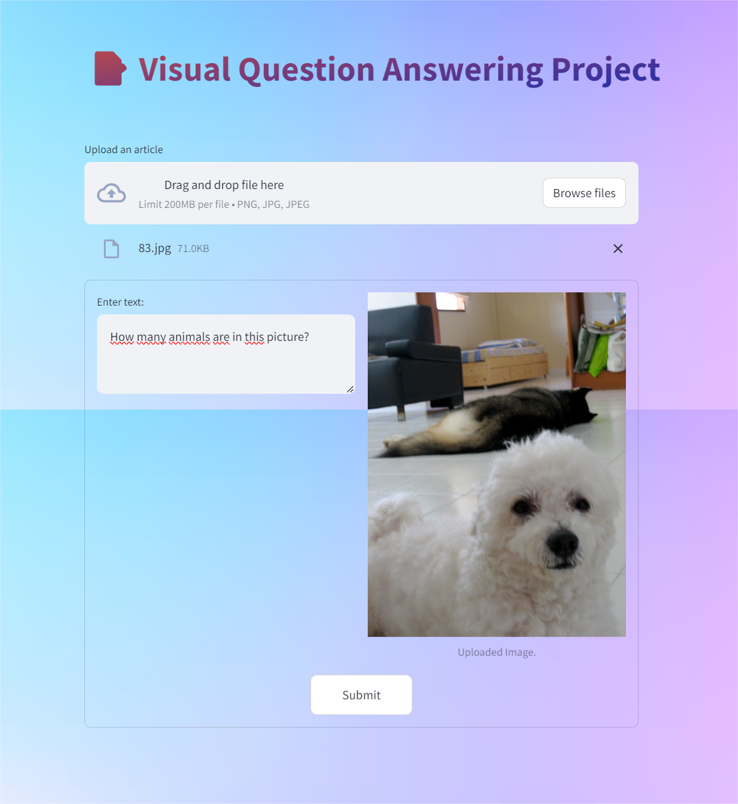

<h1 align="center">VISUAL QUESTION ANSWERING - LLM</h1>


# Bert + Vit-Google : Answer some issues from Question + realted Image by MultiModel Training
An implementation of the vqa model almost described similarly to the following in the paper:
"VQA with Cascade of Self- and Co-Attention Blocks."

Mishra, Aakansha ; Anand, Ashish ; Guha, Prithwijit

Full text available at: https://arxiv.org/pdf/2302.14777

## Contents
* [Model Overview](#model-overview)
    * [Introduction](#introduction)
    * [Architecture](#architecture)
* [Getting Started](#getting-started)
    * [Install Required Packages](#install-required-packages)
    * [Prepare the Training Data](#prepare-the-training-data)
    * [Download Base Models](#download-base-models)
* [Inference and Demo](#infer-and-demo)
    * [Results](#results)
    * [Deployment on HuggingFace](#deployment-on-huggingface)
    * [Acknowledgements](#acknowledgements)
    * [Future Plans](#future-plans)
    * [References](#references)
* [Citaion](#citation)


## Model Overview

### Introduction

Building a multi-model usually is a difficult challenge that scientists want to explore and conquer. With the quick development of technology and algorithms, the majority of current approaches can be easier than the previous time. This project was created with a big desire to bring many valuable results when merging many large language models (LLM) together and deeply related knowledge.    

VQA model is a deep neural network that learns and responds to users when they provide questions and related images, the model will answer reliance on those information. Namely, as below images:

<p align="center">
  
  
</p>

### Architecture

<p align="center">
  
  
</p>

## Getting Started

### Install Required Packages
(It is recommended to install the dependencies under Conda environment.)  
* python 3.7, 3.8, 3.9  
* tqdm  
* pytorch==0.4.0
* torchvision
* cython
* matplotlib
* numpy
* scipy
* pyyaml
* packaging
* pycocotools
* tensorboardx
* h5py
* opencv-python
* streamlit
* pillow # for PIL

**The required supportive environment uses a hardware accelerator GPUs such as T4 of Colab, GPU A100, etc.**

### Prepare the Training Data

Name | #Image | #Question | #Answer
| :------:| :------: | :------: | :-----: |
Train | 5000 | 248350 | 248350
Validation | 2500 | 121513 | 121513
Test | 2500 | 107395 | 107395

All of orignal file are formatted in JSON files, after handling data processing, they has formatted in CSV files.

The csv files have some attribution:

```json
[
    {
        "image_id": int,
        "question": str,
        "question_id": int,
        "answer" : str
    }
]
```


### Download Based Models

Google - Bert ( textual_feature_extractor ): BERT is a transformers model pretrained on a large corpus of English data in a self-supervised fashion. This means it was pretrained on the raw texts only, with no humans labeling them in any way (which is why it can use lots of publicly available data) with an automatic process to generate inputs and labels from those texts. [Available on this link](https://huggingface.co/google-bert/bert-base-uncased)


Google - ViT ( visual_feature_extractor ): The Vision Transformer (ViT) is a transformer encoder model (BERT-like) pretrained on a large collection of images in a supervised fashion, namely ImageNet-21k, at a resolution of 224x224 pixels. [Available on this link](https://huggingface.co/google/vit-base-patch16-224-in21k)


## Inference And Demo


### Results

| Data | #WUPS | #MRR | #Loss |
| --- | --- | --- |  --- |
| [Train]() | 0.23114 |	0.32561 | 4.52219 |
| [Validation]() | 0.23152	|  0.32828 |	5.18071 |


### Deployment on HuggingFace

I used Streamlit Framework for deploying this model but it can only could be run locally, if wanting to run it on the server of HuggingFace, we need to complete some steps related to registering the model (because this model is built from scratch) [more information](https://huggingface.co/docs/transformers/custom_models)

<p align="center">
  
  
</p>

### Acknowledgements

- [BERT Model](https://huggingface.co/docs/transformers/model_doc/bert)
- [Vision Transfomer - ViT](https://huggingface.co/docs/transformers/model_doc/vit)
- [MultiModel](https://research.google/blog/multimodel-multi-task-machine-learning-across-domains/)

- Logo is generated by [@tranphihung](https://github.com/tph-kds)

### Future Plans

- Fine-tune on a larger dataset
- Evaluation on downstream tasks
- Experiment with different model sizes
- Experiment with different serving frameworks: vLLM, TGI, Triton Inference Server, etc.
- Experiment with expanding the tokenizer and prepare for pre-training

Stay tuned for future releases as we are continuously working on improving the model, expanding the dataset, and adding new features.

Thank you for your interest in my project. We hope you find it useful. If you have any questions, please feel free and don't hesitate to contact me at [tranphihung8383@gmail.com](tranphihung8383@gmail.com)

### References

- PAPER: OK-VQA: A Visual Question Answering Benchmark Requiring
External Knowledge
[Available on this link](https://arxiv.org/pdf/1906.00067). [Online; accessed June 1, 2024].


- PAPER: Stanislaw Antol and others. “VQA: Visual Question Answering”.
inInternational Conference on Computer Vision (ICCV): 2015.
[Available on this link](https://arxiv.org/pdf/1505.00468). [Online; accessed June 1, 2024].

- PAPER: Yash Goyal andothers. Making the V in VQA Matter: Elevating the
Role of Image Understanding in Visual Question Answering. 2017.
arXiv: 1612.00837 [cs.CV]. 
[Available on this link](https://arxiv.org/abs/1612.00837). [Online; accessed June 1, 2024].

## Citation

If you find this repo useful in your research, please consider citing the following papers:

```latex
@article{mishra2023vqa,
  title={VQA with Cascade of Self-and Co-Attention Blocks},
  author={Mishra, Aakansha and Anand, Ashish and Guha, Prithwijit},
  journal={arXiv preprint arXiv:2302.14777},
  year={2023}
}
```
